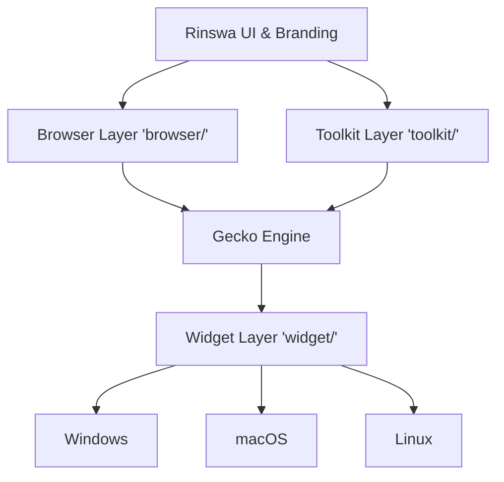

# Rinswa Browser Architecture

## Architecture Overview
Rinswa is a modern, privacy-conscious desktop web browser based on Mozilla Firefox/Gecko. Its core philosophy is to leverage the robust, standard-compliant Gecko engine while providing a minimalist, tracking-free, custom UI layer. Rinswa uses a shared browser layer leveraging Firefox's `toolkit/` and `browser/` components, heavily customizing the UI layer while keeping the underlying engine untouched.

## Component Diagram

## Source Organization
The Rinswa source repository will mirror `mozilla-central`. Modifications will primarily occur in:
- `browser/`: Desktop browser UI (HTML/CSS/JS/WebComponents), themes, branding.
- `toolkit/`: Shared application services, profile management, extension core.
- `widget/`: Platform-specific abstractions.
- `build/` & `python/mozbuild/`: Build configuration, `moz.build`, and `mach` tools.

## Firefox Integration Points
Modifications will hook into existing Firefox mechanisms:
- **UI:** Overriding `browser/base/content/browser.html` and related WebComponents.
- **Preferences:** Modifying `browser/app/profile/firefox.js` and `modules/libpref/init/all.js`.
- **Localization:** Using Fluent (`.ftl`) in `browser/locales/` and `toolkit/locales/`.

## Platform Abstraction Strategy
Rinswa will rely entirely on Gecko's existing platform abstraction:
- **Graphics/Compositing:** WebRender (`gfx/`).
- **Networking:** Necko (`netwerk/`).
- **OS Integration:** `widget/` directory for window management, native menus, and file dialogs.
Platform-specific code should remain strictly within `widget/` or `hal/`. No custom abstraction layers will be added.

## UI Architecture
Rinswa's UI replaces Firefox's UI with a modern, minimalist interface.
- Built using **WebComponents** (custom elements) and **Fluent** for localization.
- HTML/CSS/JS replacing traditional XUL elements.
- The main window is instantiated via `browser.html`.

## Settings Architecture
Preferences are managed by the `libpref` system.
- Default settings are defined in `browser.js` and `all.js`.
- Telemetry, Pocket, and sponsored content will be disabled at the `libpref` level.
- User-facing settings page (`about:preferences`) will be customized by modifying `browser/components/preferences/`.

## Privacy Architecture
Privacy by default:
- Telemetry (`toolkit/components/telemetry/`) disabled via build flags and prefs.
- Enhanced Tracking Protection (ETP) strictly enforced.
- Removal of third-party integrations (Pocket, Google SafeBrowsing telemetry, Activity Stream ads).

## Update Architecture
Rinswa will implement a custom update server compatible with Firefox's updater (`toolkit/mozapps/update/`).
- Background updates using the existing Mozilla updater client (written in C/C++ and JS).
- Update channels (Release, Beta) managed via `update-settings.ini` and `channel-prefs.js`.

## Extension Architecture
Full compatibility with Firefox WebExtensions.
- Handled by `toolkit/components/extensions/`.
- No changes to the WebExtension API.
- Add-on signing restrictions can be relaxed or modified to point to a custom extension infrastructure.

## Build Architecture
Uses the standard Mozilla build system:
- `mach`: The command-line build orchestrator.
- `mozconfig`: Build configuration files per platform/target.
- `moz.build`: Build definitions.
- Toolchains: Clang/LLVM for Windows/macOS/Linux to ensure consistency across platforms (x64 and ARM64).

## Testing Architecture
Maintains Firefox's testing suites to ensure engine stability:
- `mochitest`: For browser UI and DOM testing.
- `xpcshell`: For XPCOM and backend JS testing.
- `web-platform-tests (WPT)`: For web standard compliance.

## Upstream Firefox Synchronization Strategy
Rinswa will be maintained as a set of patches or a git branch rebased on `mozilla-central` (ESR or Rapid Release).
- Keep modifications strictly to `browser/`, `toolkit/`, and `build/`.
- Avoid touching `dom/`, `layout/`, and `js/` to minimize merge conflicts.
- Automate rebase and conflict detection via CI.
